# Exercise: Data Ingestion on AWS
We'll be creating a Glue Job to run the Spark (Python) job that we created in another exercise. That Spark (Python) job will put its result into an existing AWS S3 bucket.  In order to query the results in the S3 bucket in Athena, we'll create a Crawler to create metadata of the contents of our S3 bucket.

[What is AWS Glue?](https://docs.aws.amazon.com/glue/latest/dg/what-is-glue.html)

**NOTE:** In the following, anywhere `awesome-project-awesome-module` are used (`project-name`: awesome-project, `module-name`=awesome-module) should be replaced with your own unique name. This name must match the name of the S3 bucket that was previously created in the [previous exercise](https://github.com/data-derp/exercise-co2-vs-temperature-production-code) or via [fresh-start](./README.md#fresh-start)

## Overview
1. [Upload Data Source files](#upload-data-source)
2. [Create an IAM Policy](#create-an-iam-policy)
3. [Create a Role and attach IAM Policy](#create-a-role)
4. [Create a Glue Job](#create-a-glue-job)
5. [Create Glue Crawler](#create-a-crawler)
6. [View Results in Athena](#view-results-in-athena)

## Upload data-source
The Glue Job that we'll create requires some data to ingest. Upload them to your S3 Bucket. ([Ensure you have an active AWS CLI Session](https://docs.aws.amazon.com/cli/latest/userguide/cli-chap-configure.html))

```bash
# Pick your own project-name and module-name
export PROJECT_NAME=awesome-project
export MODULE_NAME=awesome-module

./go upload-data-source "${PROJECT_NAME}-${MODULE_NAME}"
```

## Create an IAM Policy
The Glue Job and Crawler that will be created in the next steps require an IAM Role that carry out actions.
1. Navigate to  **AWS Console** > **IAM** > **Access Management** > **Policies**
2. Click **Create Policy**
   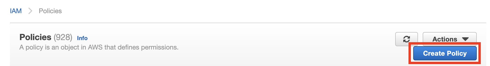
3. Click the **json** tab and enter the following policy:
    ```json
    {
      "Version": "2012-10-17",
      "Statement": [
        {
          "Effect": "Allow",
          "Action": [
            "logs:CreateLogGroup",
            "logs:CreateLogStream",
            "logs:PutLogEvents"
          ],
          "Resource": [
            "arn:aws:logs:*:*:/aws-glue/*"
          ]
        },
        {
          "Effect": "Allow",
          "Action": [
            "kms:Decrypt",
            "kms:GenerateDataKey"
          ],
          "Resource": "*"
        }
      ]
    }
    ```
   This policy will allow our [to be] created role to write logs to the default Cloudwatch logs group for the AWS Glue Job that we will create and decrypt objects in our AWS S3 bucket (which is encrypted using AWS KMS). **NOTE:** typically, it is better practice to lock down the resources (not use `*` under `resources`) that a role can use but we'll continue to use it here for simplicity purposes for this exercise.
4. Click **Next: Tags** and **Next: Review**
5. Name your policy (must be unique in the AWS Account)
    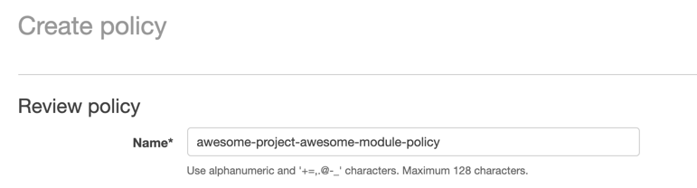
6. Click **Create Policy**

## Create a Role
Now we'll create an IAM Role that uses that Policy.
1. Navigate to the **AWS Console** > **IAM** > **Access Management** > **Roles**
2. Click **Create Role**
   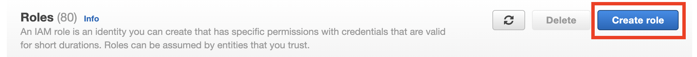
3. **Choose a Use Case**, select **Glue**
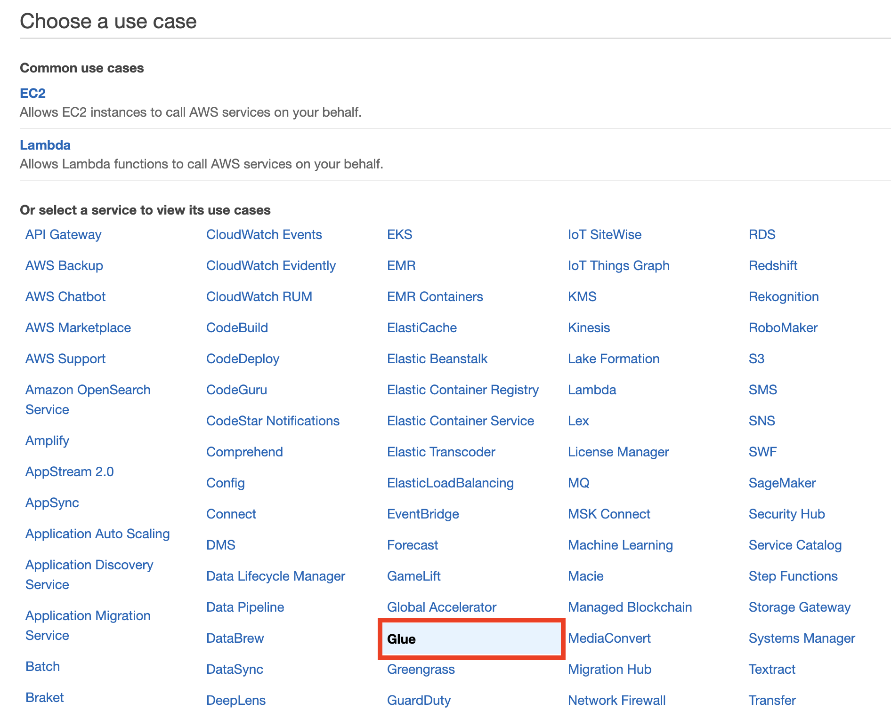
4. Click **Next: Permissions**
5. Search and select the following
    * AmazonS3FullAccess
    * AWSGlueServiceRole
    * The policy that you created earlier, in this case **awesome-project-awesome-module-policy**
    **NOTE:** Typically, AmazonS3FullAccess is too permissions but again for simplicity's sake, we'll use it in this exercise.
6. Click **Next: Tags** and **Next: Review**
7. Name your role (must be unique in the AWS Account) and verify the list of policies for correctness
   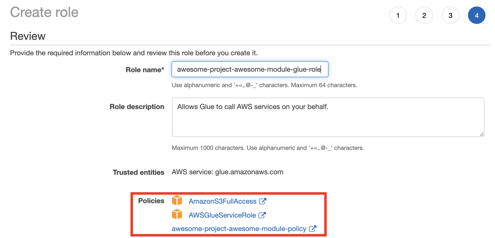
8. Click **Create Role**

## Create a Glue Job
Here we'll create a Glue Job that will run our Ingestion code.
1. Navigate to the **AWS Console** > **AWS Glue** > **ETL** > **Jobs**
2. Click **Add job**
    

3. Under **Configure the job properties**
    * Name: <some-name>**-data-ingestion** (must be unique, e.g. `awesome-project-awesome-module-data-ingestion`)
    * IAM role: Select the **role that you just created**
    * Type: **Spark**
    * Glue version: **Spark 2.4, Python 3 (Glue Version 2.0)**
    * This job runs **An existing script that you provide**
    * S3 path where the script is stored: **s3://awesome-project-awesome-module/data-ingestion-artifacts/main.py**
    * Temporary directory: **s3://awesome-project-awesome-module/data-ingestion/temp/**
4. Under Monitoring Options, select:
   * [x] Job metrics
   * [x] Continuous logging
   * [x] Spark UI
   * Amazon S3 prefix for Spark event logs: **s3://awesome-project-awesome-module/data-ingestion/spark-logs**
   
   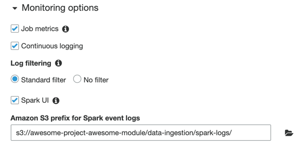
5. Under **Security configuration, script libraries, and job parameters**, select the following configuration:
    * Python library path: **s3://awesome-project-awesome-module/data-ingestion-artifacts/data_ingestion-0.1-py3.egg**
    * Number of workers: **2**
    
    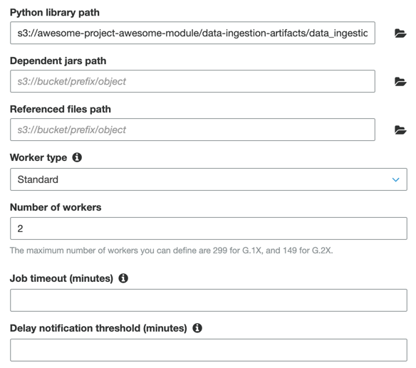
   
    And then under **Job Parameters**:

   | key | value | 
   | --- | --- |
   | --continuous-log-logGroup | awesome-project-awesome-module-data-ingestion/glue|
   | --extra-py-files | s3://awesome-project-awesome-module/data-ingestion-artifacts/data_ingestion-0.1-py3.egg |
   | --temperatures_country_input_path | s3://awesome-project-awesome-module/data-source/TemperaturesByCountry.csv |
   | --temperatures_country_output_path | s3://awesome-project-awesome-module/data-ingestion/TemperaturesByCountry.parquet |
   | --temperatures_global_input_path | s3://awesome-project-awesome-module/data-source/GlobalTemperatures.csv |
   | --temperatures_global_output_path | s3://awesome-project-awesome-module/data-ingestion/GlobalTemperatures.parquet |
   | --co2_input_path | s3://awesome-project-awesome-module/data-source/EmissionsByCountry.csv |
   | --co2_output_path | s3://awesome-project-awesome-module/data-ingestion/EmissionsByCountry.parquet |

   **NOTE:** Beware the trailing spaces! Ensure that your keys and values don't have trailing spaces or your job might fail with an error of Invalid Parameters.

6. Click **Next** and **Save job and edit script** and **Save Job**
   
7. Back in **AWS Glue** > **ETL** > **Jobs**, run the job:
   
8. Check that the Job has passed in the Job History pane and that you have new files in your S3 Bucket.

## Create a Crawler
We'll create a Crawler to gather metadata (schema) of our ingested data and update the Data Catalog.
1. Under **AWS Console** > **AWS Glue** > **Data Catalog** > **Databases**
   
   
2. Create a database
   
   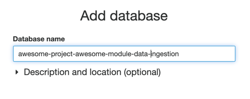
3. Under **AWS Console** > **AWS Glue** > **Crawlers**, click **Add Crawler**
   
   
4. Add the name of your crawler and click **Next**
   
   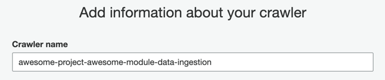
5. Add the crawler type (likely the default settings) and click **Next**

    
6. Add a datastore and click **Next**

   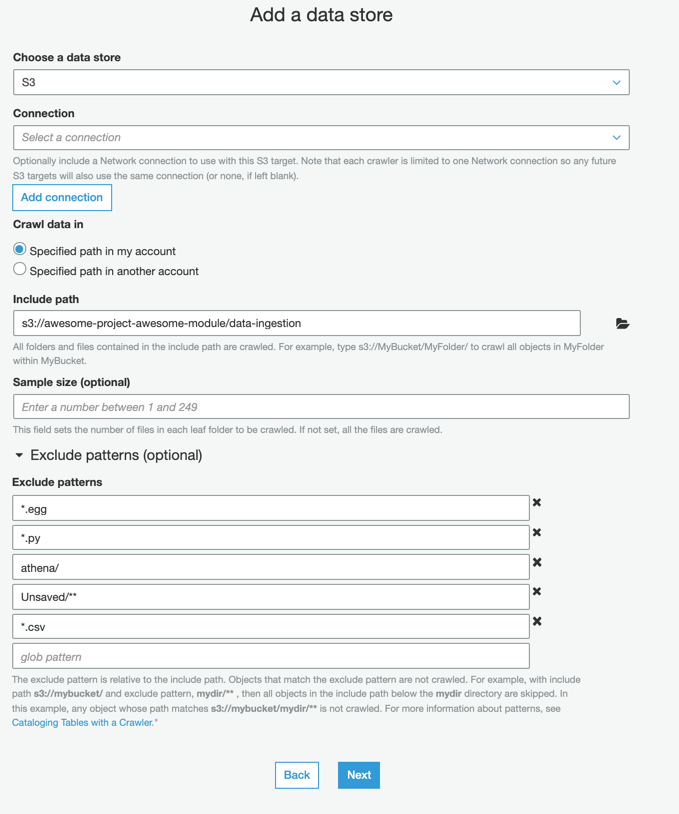
7. When prompted to "Add Another Datastore", check **no** and click **Next**
8. Select the IAM role that was created earlier in the exercise

   
9. Set the schedule to be "Run on Demand" and click **Next**

   
10. Set the Crawler Output. **NOTE:** the trailing underscore in the **Prefix**

   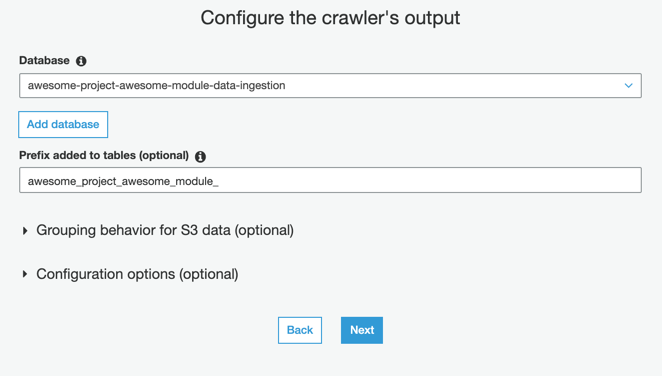

11. After reviewing the configuration, click **Finish**

   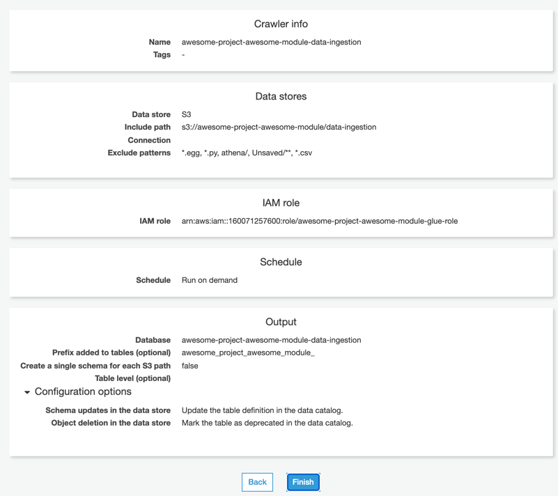

12. In **AWS Console** > **AWS Glue** > **Crawlers**, select your crawler and click **Run Crawler**
13. If successful, a table should appear under **AWS Console** > **AWS Glue** > **Data Catalog** > **Tables**

## View Results in Athena
Now that we have updated our Data Catalog, let's view our data in Athena!
1. Navigate to **AWS Console** > **AWS Athena**
2. You'll see a notification:
   
3. Click **Manage**
   
4. Choose your S3 bucket and a path **/athena** as the location where your query results will appear. Click **Save**.
   
5. Back in the Athena > Query Editor, select the **AwsDataCatalog** under **Data Source** and your database (suffixed with `-data-ingestion`) under **Database**. Three tables should now appear. Click the three dots next to each table to generate a query which will automatically run and show the data in each table.
   