# Exercise: Data Transformation on AWS
In this exercise, we'll be creating a second AWS Glue Job to run our Transformation Spark job and a second AWS Crawler. Please be sure to first run the [Exercise on Data Ingestion](./data-ingestion.md)

**NOTE:** In the following, anywhere `awesome-project-awesome-module` (S3 Bucket) are used (project-name: awesome-project, module-name=awesome-module) should be replaced with your own unique name. This name must match the name of the S3 bucket that was previously created in the [previous exercise](https://github.com/data-derp/exercise-co2-vs-temperature-production-code). or via [fresh-start](./README.md#fresh-start)

## Overview
1. [Create a Glue Job](#create-a-glue-job)
2. [Create Glue Crawler](#create-a-crawler)
3. [View Results in Athena](#view-results-in-athena)

## Create a Glue Job
Here we'll create a Glue Job that will run our Transformation code.
1. Navigate to the **AWS Console** > **AWS Glue** > **ETL** > **Jobs**
2. Click **Add job**
   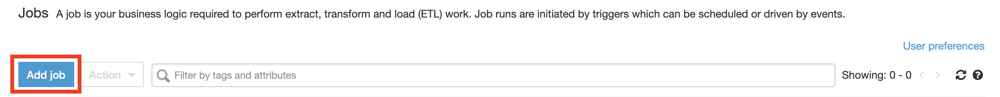

3. Under **Configure the job properties**
   * Name: <some-name>**-data-transformation** (must be unique, e.g. `awesome-project-awesome-module-data-transformation`)
   * IAM role: Select the **role that you just created**
   * Type: **Spark**
   * Glue version: **Spark 2.4, Python 3 (Glue Version 2.0)**
   * This job runs **An existing script that you provide**
   * S3 path where the script is stored: **s3://awesome-project-awesome-module/data-transformation/main.py**
   * Temporary directory: **s3://awesome-project-awesome-module/data-transformation/temp/**
4. Under Monitoring Options, select:
   * [x] Job metrics
   * [x] Continuous logging
   * [x] Spark UI
   * Amazon S3 prefix for Spark event logs: **s3://awesome-project-awesome-module/data-transformation/spark-logs**

   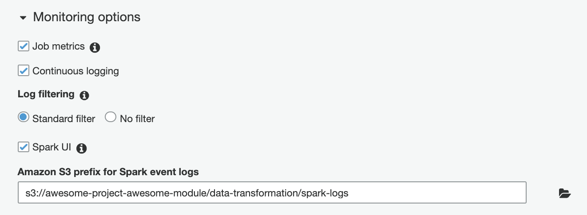
5. Under **Security configuration, script libraries, and job parameters**, select the following configuration:
   * Python library path: **s3://awesome-project-awesome-module/data-transformation/data_transformation-0.1-py3.egg**
   * Number of workers: **2**

   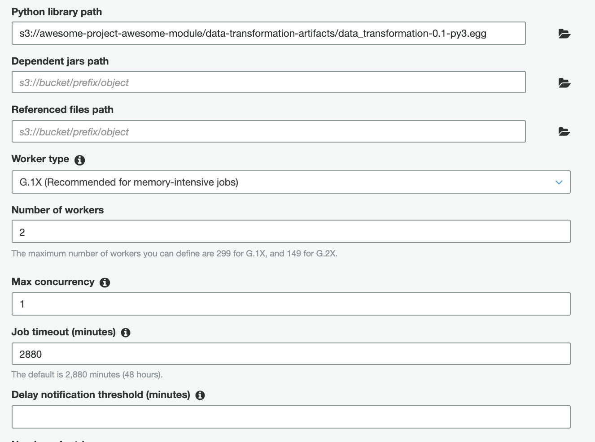

   And then under **Job Parameters**:
   | key | value | 
   | --- | --- |
   | --continuous-log-logGroup | awesome-project-awesome-module-data-transformation/glue|
   | --co2_input_path | s3://awesome-project-awesome-module/data-ingestion/EmissionsByCountry.parquet/ |
   | --temperatures_global_input_path | s3://awesome-project-awesome-module/data-ingestion/GlobalTemperatures.parquet/ |
   | --temperatures_country_input_path | s3://awesome-project-awesome-module/data-ingestion/TemperaturesByCountry.parquet/ |
   | --co2_temperatures_global_output_path | s3://$awesome-project-awesome-module/data-transformation/GlobalEmissionsVsTemperatures.parquet/ |
   | --co2_temperatures_country_output_path | s3://awesome-project-awesome-module/data-transformation/CountryEmissionsVsTemperatures.parquet/ |
   | --europe_big_3_co2_output_path | s3://awesome-project-awesome-module/data-transformation/EuropeBigThreeEmissions.parquet/ |
   | --co2_oceania_output_path | s3://awesome-project-awesome-module/data-transformation/OceaniaEmissionsEdited.parquet/ |
   
   **NOTE:** Beware the trailing spaces! Ensure that your keys and values don't have trailing spaces or your job might fail with an error of Invalid Parameters.

6. Click **Next** and **Save job and edit script** and **Save Job**
   
7. Back in **AWS Glue** > **ETL** > **Jobs**, run the job:
   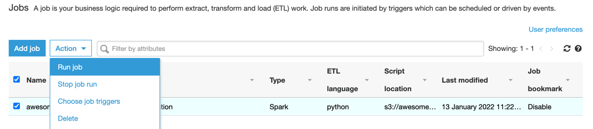
8. Check that the Job has passed in the Job History pane and that you have new files in your S3 Bucket.

## Create a Crawler
We'll create a Crawler to gather metadata (schema) of our transformed data and update the Data Catalog.
1. Under **AWS Console** > **AWS Glue** > **Data Catalog** > **Databases**

   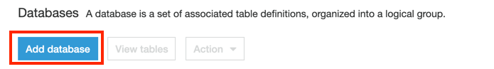

2. Create a database
   
   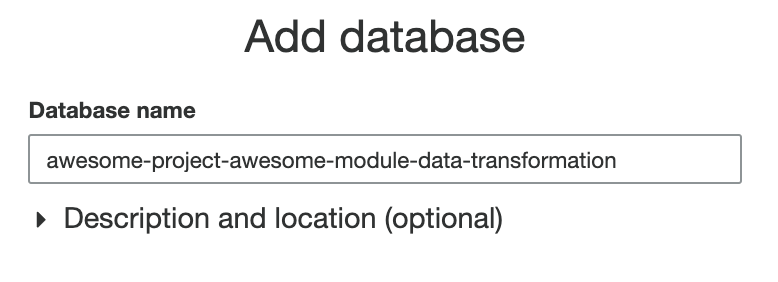

3. Under **AWS Console** > **AWS Glue** > **Crawlers**, click **Add Crawler**
   
   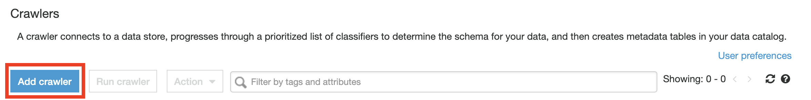

4. Add the name of your crawler and click **Next**
   
   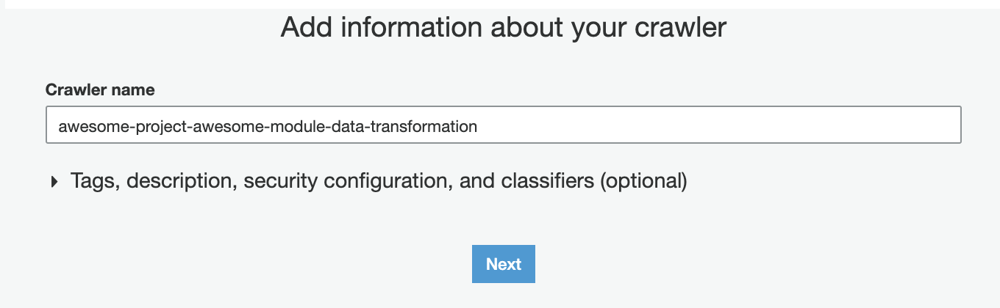

5. Add the crawler type (likely the default settings) and click **Next**
   
   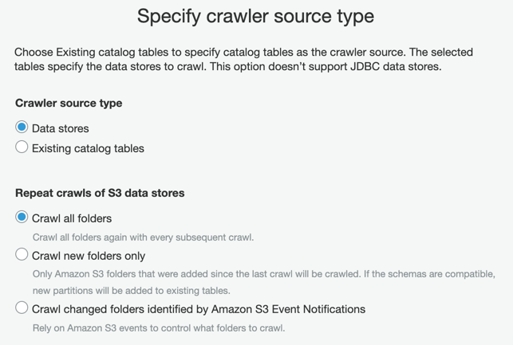

6. Add a datastore and click **Next**
   
   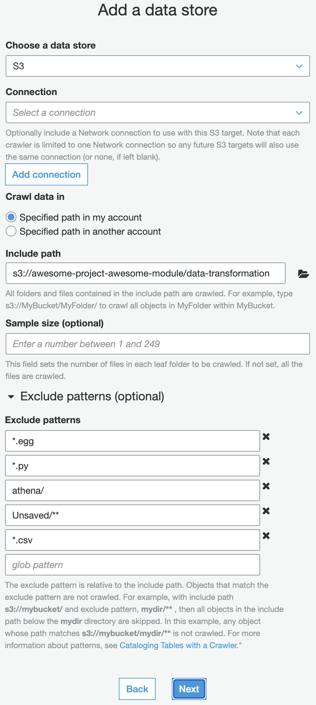

7. When prompted to "Add Another Datastore", check **no** and click **Next**

8. Select the IAM role that was created earlier in the exercise
   
   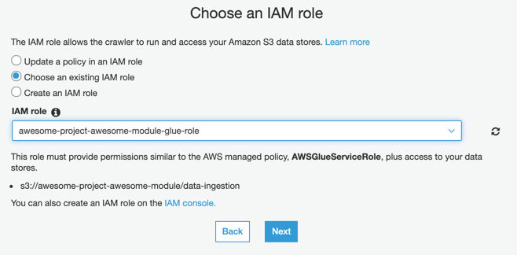
9. Set the schedule to be "Run on Demand" and click "Next"

   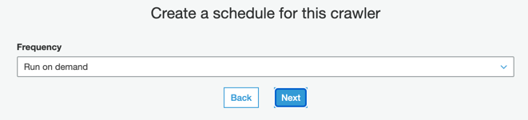

10. Set the Crawler Output. **NOTE:** the trailing underscore in the **Prefix**

   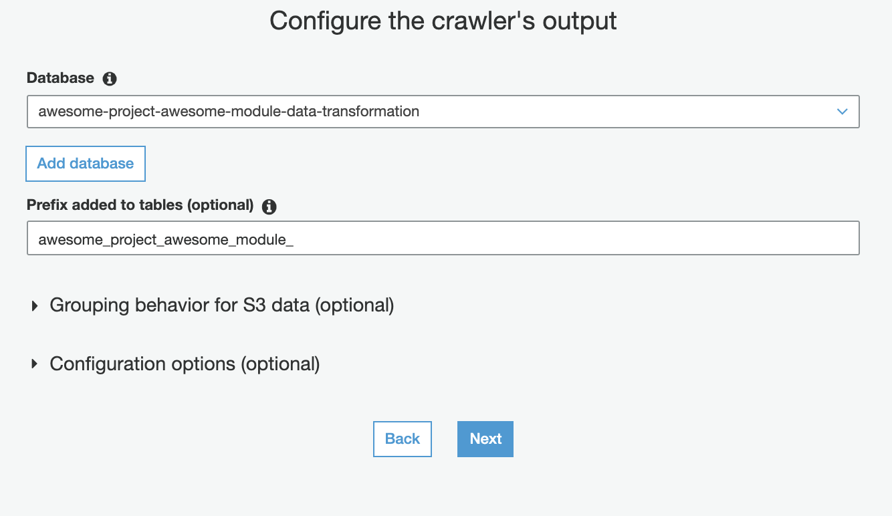

11. After reviewing the configuration, click "Finish"
    
   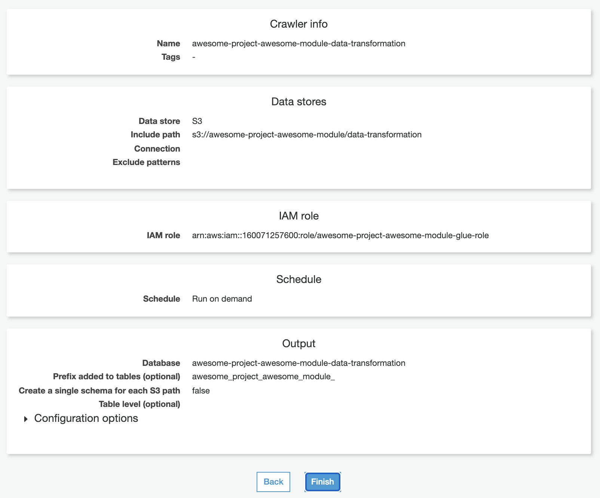

12. In **AWS Console** > **AWS Glue** > **Crawlers**, select your crawler and click **Run Crawler**

13. If successful, a table should appear under **AWS Console** > **AWS Glue** > **Data Catalog** > **Tables**

## View Results in Athena
Now that we have updated our Data Catalog, let's view our data in Athena!
1. Navigate to **AWS Console** > **AWS Athena**
2. You'll see a notification:
   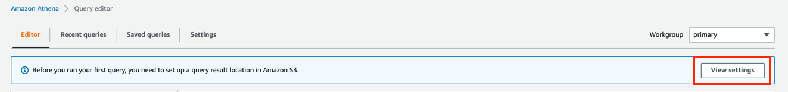
3. Click **Manage**
   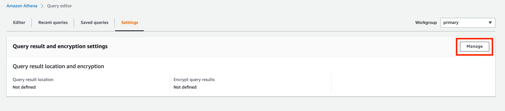
4. Choose your S3 bucket and a path **/athena** as the location where your query results will appear. Click **Save**.
   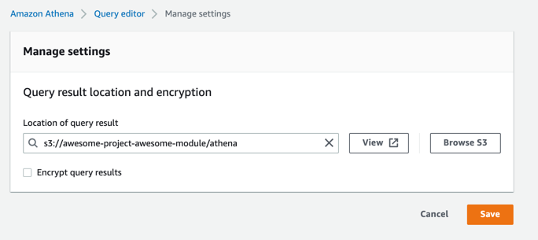
5. Back in the Athena > Query Editor, select the **AwsDataCatalog** under **Data Source** and your database (suffixed with `-data-transformation`) under **Database**. Three tables should now appear. Click the three dots next to each table to generate a query which will automatically run and show the data in each table.
   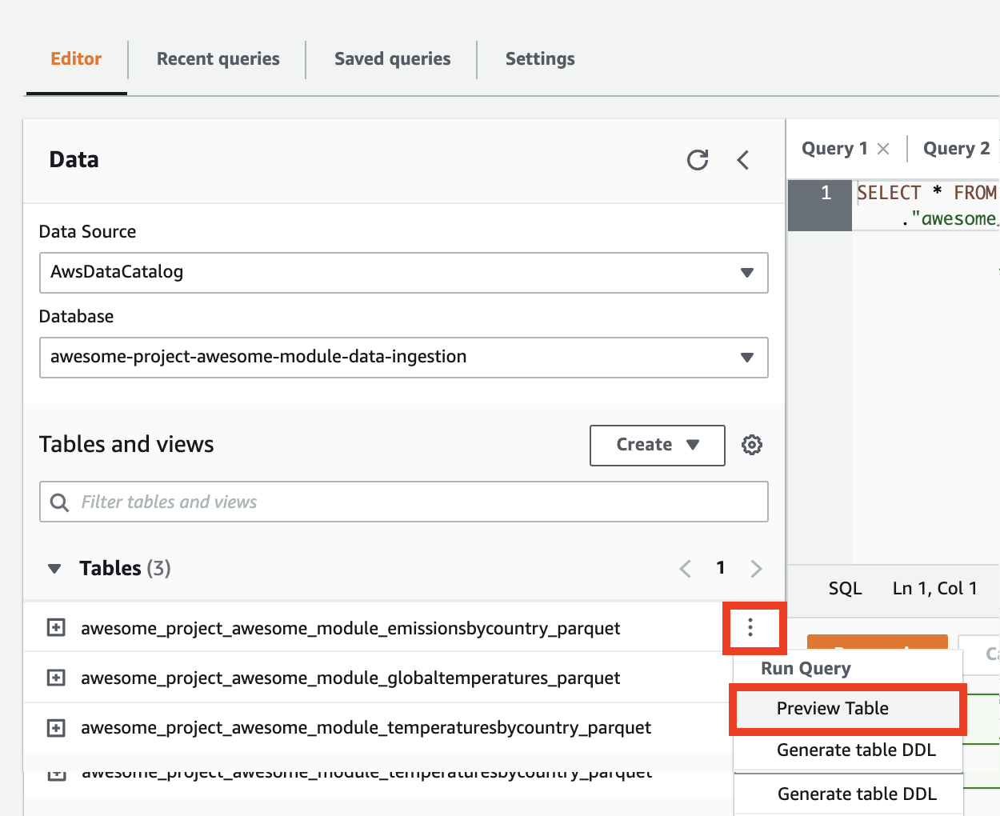