# Exercise: Data Workflow
Now that we've created Ingestion and Transformation jobs and associated crawlers, how do we coordinate all of these resources? We'll create an AWS Glue Workflow to automatically trigger everything in the right order.

* [What is an AWS Glue Workflow?](https://docs.aws.amazon.com/glue/latest/dg/workflows_overview.html)
* [What is an AWS Glue Trigger?](https://docs.aws.amazon.com/glue/latest/dg/about-triggers.html)

## Overview
1. [Create Trigger for the Ingestion Job](#create-trigger-for-the-ingestion-job)
2. [Create Trigger for the Ingestion Crawler](#create-trigger-for-the-ingestion-crawler)
3. [Create Trigger for the Transformation Job](#create-trigger-for-the-transformation-job)
4. [Create Trigger for the Transformation Crawler](#create-trigger-for-the-transformation-crawler)
5. [Create a Workflow](#create-a-workflow)
6. [Add Triggers to Workflow](#add-triggers-to-workflow)

## Create Trigger for the Ingestion Job
1. Navigate to  **AWS Console** > **Glue** > **ETL** and click on **Triggers**
2. Click **Add Trigger**

   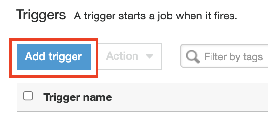

3. Set up Trigger with `-trigger-ingestion` suffix and an **Job events** trigger for the `data-ingestion` job. Click **Next**.
   
   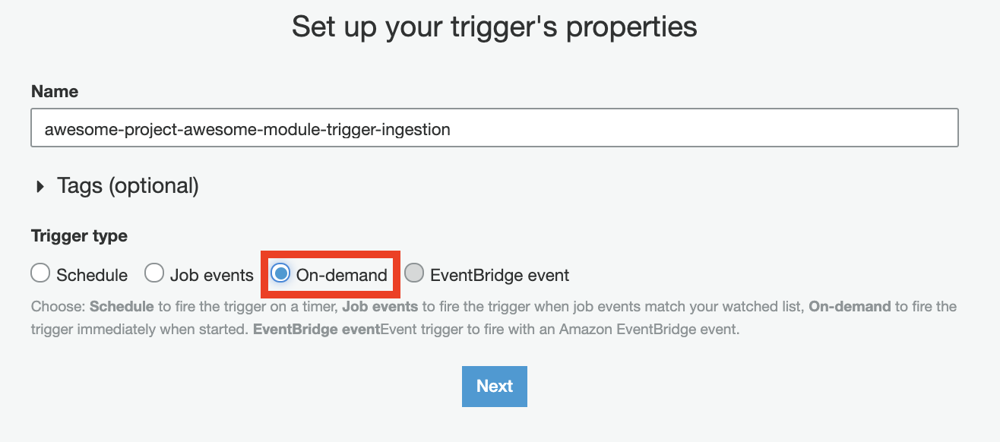

4. Add Jobs to trigger and click **Next**"
   
   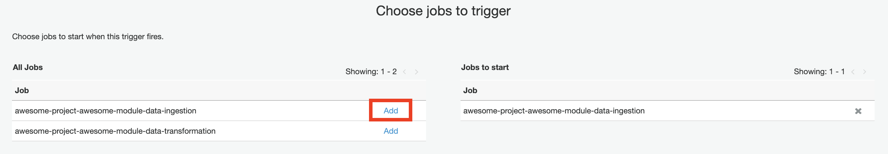

5. Review and click **Finish**.

   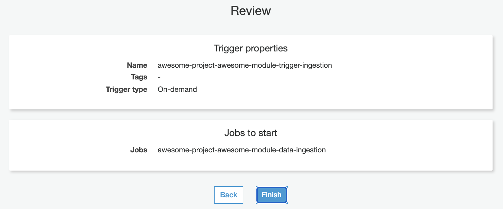

## Create Trigger for the Ingestion Crawler
1. Unfortunately for us, you cannot create a Trigger for a Crawler using the AWS Console (at the time of writing).
2. Using a Terminal session with valid AWS CLI credentials, run the following:
   ```bash
   UPSTREAM_JOB_NAME=awesome-project-awesome-module-data-ingestion
   CRAWLER_NAME=awesome-project-awesome-module-data-ingestion
   REGION=your-region
   aws glue create-trigger --name awesome-project-awesome-module-data-ingestion-crawler-trigger \
    --type CONDITIONAL \
    --predicate "Logical=ANY,Conditions=[{LogicalOperator=EQUALS,JobName=${UPSTREAM_JOB_NAME},State=SUCCEEDED}]" \
    --actions CrawlerName=${CRAWLER_NAME} \
    --no-start-on-creation \
    --region $REGION
   ```
   Success Response:
   ```json
   {
    "Name": "awesome-project-awesome-module-data-ingestion-crawler-trigger"
   }
   ```


## Create Trigger for the Transformation Job
1. Unfortunately for us, you cannot create a Trigger for a Crawler/Job combination using the AWS Console (at the time of writing).
2. Using a Terminal session with valid AWS CLI credentials, run the following:
   ```bash
   UPSTREAM=awesome-project-awesome-module-data-ingestion
   DOWNSTREAM=awesome-project-awesome-module-data-transformation
   REGION=your-region
   aws glue create-trigger --name awesome-project-awesome-module-transformation-trigger \
    --type CONDITIONAL \
    --predicate "Logical=ANY,Conditions=[{LogicalOperator=EQUALS,CrawlerName=${UPSTREAM},CrawlState=SUCCEEDED}]" \
    --actions JobName=${DOWNSTREAM} \
    --no-start-on-creation \
    --region $REGION
   ```
   Success Response:
   ```json
   {
    "Name": "awesome-project-awesome-module-transformation-trigger"
   }
   ```

## Create Trigger for the Transformation Crawler
1. Unfortunately for us, you cannot create a Trigger for a Crawler using the AWS Console (at the time of writing).
2. Using a Terminal session with valid AWS CLI credentials, run the following:
   ```bash
   UPSTREAM=awesome-project-awesome-module-data-transformation
   DOWNSTREAM=awesome-project-awesome-module-data-transformation
   REGION=your-region
   aws glue create-trigger --name awesome-project-awesome-module-data-transformation-crawler-trigger \
    --type CONDITIONAL \
    --predicate "Logical=ANY,Conditions=[{LogicalOperator=EQUALS,JobName=${UPSTREAM},State=SUCCEEDED}]" \
    --actions CrawlerName=${DOWNSTREAM} \
    --no-start-on-creation \
    --region $REGION
   ```
   Success Response:
   ```json
   {
    "Name": "awesome-project-awesome-module-data-transformation-crawler-trigger"
   }
   ```
## Create a Workflow
1. Navigate to  **AWS Console** > **Glue** > **ETL** and click on **Workflows**
2. Click **Add workflow**
   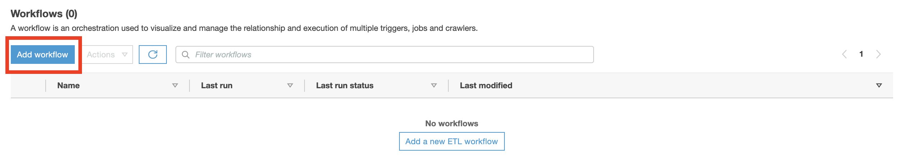
3. Name your workflow
   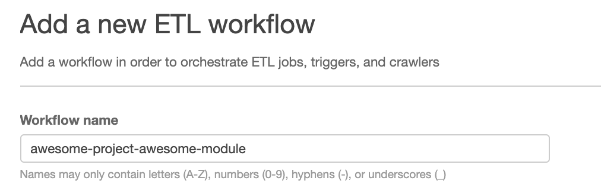
4. Click **Add workflow**

## Add Triggers to Workflow
1. Navigate to  **AWS Console** > **Glue** > **ETL** and click on **Workflows**
2. Select your workflow and click **Add trigger**
   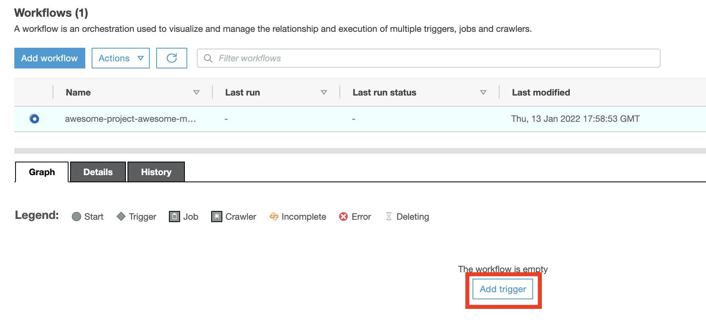
3. Add the `-ingestion` job trigger
   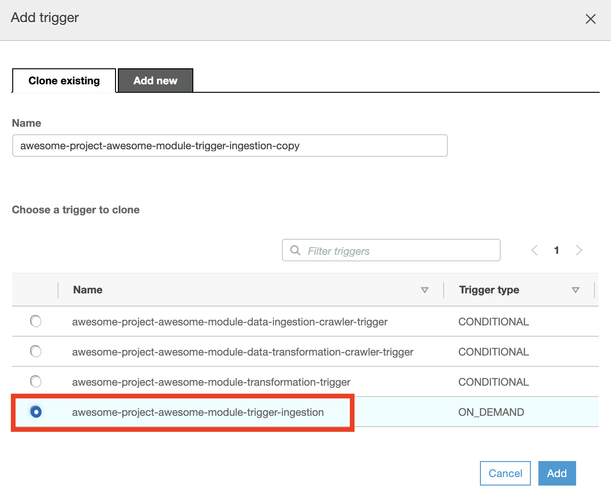
4. In **AWS Console** > **Glue** > **ETL** and click on **Workflows**, select your workflow and click **Add trigger**
5. Add the data ingestion crawler trigger
   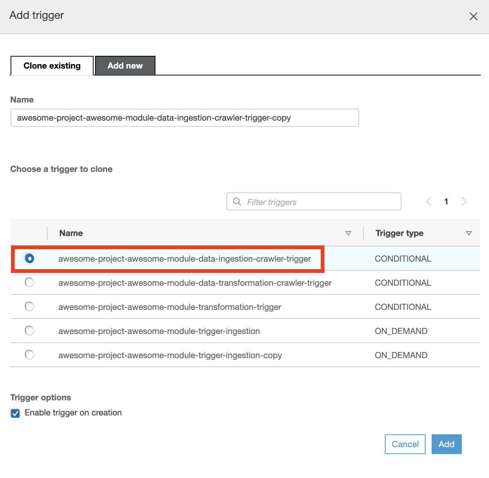
6. In **AWS Console** > **Glue** > **ETL** and click on **Workflows**, select your workflow and click **Add trigger**
7. Add the `-transformation` job trigger
   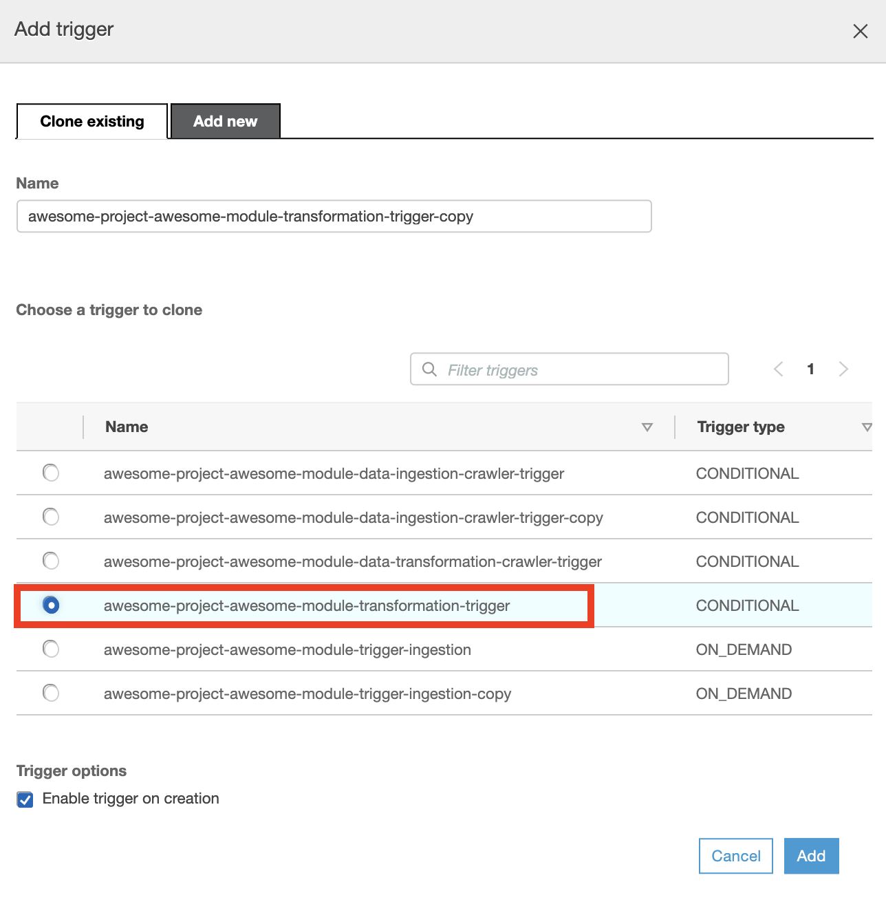
8. In **AWS Console** > **Glue** > **ETL** and click on **Workflows**, select your workflow and click **Add trigger**
9. Add the data transformation crawler trigger
   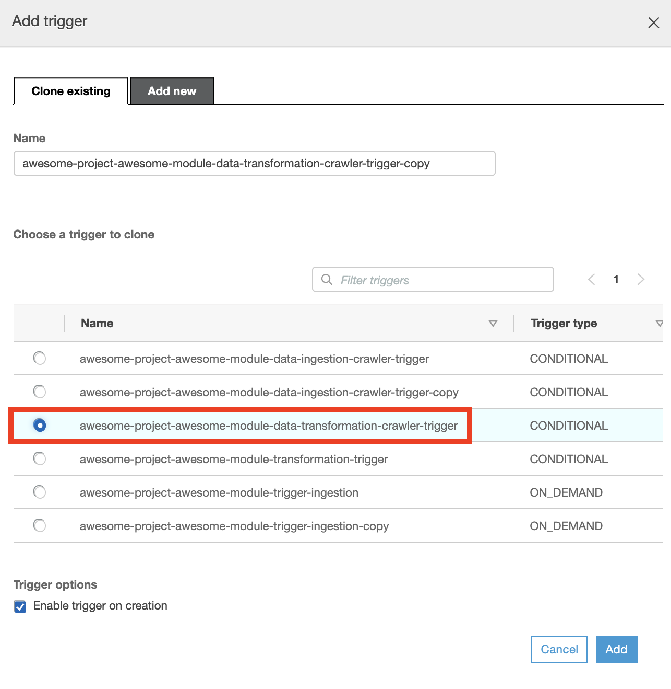
10. In **AWS Console** > **Glue** > **ETL** and click on **Workflows**, select your workflow and click **Actions** > **Run**
11. Open the **History** tab, select the most recent workflow run, and click **View Run Details** to see the progress.
   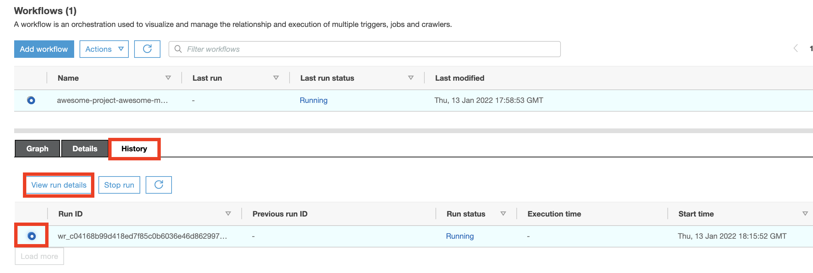
12. Once the workflow is successful, verify that there are newly ingested files in the relevant directories in your AWS S3 bucket and the data is accessible via AWS Athena.
