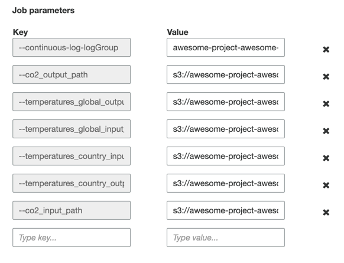

# Exercise
## Upload data-source
```bash
./go upload-data-source <your-bucket-name>
```

## Data Ingestion
We'll be creating a Glue Job and a Glue Crawler
    - what is a glue job / crawler?
1. Create a role with policies
   1. used by the Glue Job and crawler

2. Create a Glue Job
3. Create crawler
4. View in Athena

## Create a Role
### Policy
1. Nagivate to the **AWS Console** > **IAM** > **Access Management** > **Policies**
2. Click **Create Policy**
   
3. Click the **json** tab and enter the following policy:
    ```json
    {
      "Version": "2012-10-17",
      "Statement": [
        {
          "Effect": "Allow",
          "Action": [
            "logs:CreateLogGroup",
            "logs:CreateLogStream",
            "logs:PutLogEvents"
          ],
          "Resource": [
            "arn:aws:logs:*:*:/aws-glue/*"
          ]
        },
        {
          "Effect": "Allow",
          "Action": [
            "kms:Decrypt",
            "kms:GenerateDataKey"
          ],
          "Resource": "*"
        }
      ]
    }
    ```
   This policy will allow our [to be] created role to write logs to the default Cloudwatch logs group for the AWS Glue Job that we will create and decrypt objects in our AWS S3 bucket (which is encrypted using AWS KMS). **NOTE:** typically, it is better practice to lock down the resources (not use `*` under `resources`) that a role can use but we'll continue to use it here for simplicity purposes for this exercise.
4. Click **Next: Tags** and **Next: Review**
5. Name your policy (must be unique in the AWS Account)
    
6. Click **Create Policy**

### Create a Role
1. Nagivate to the **AWS Console** > **IAM** > **Access Management** > **Roles**
2. Click **Create Role**
   
3. **Choose a Use Case**, select **Glue**

4. Click **Next: Permissions**
5. Search and select the following
    * AmazonS3FullAccess
    * AWSGlueServiceRole
    * The policy that you created earlier, in this case **awesome-project-awesome-module-policy**
    **NOTE:** Typically, AmazonS3FullAccess is too permissions but again for simplicity's sake, we'll use it in this exercise.
6. Click **Next: Tags** and **Next: Review**
7. Name your role (must be unique in the AWS Account) and verify the list of policies for correctness
   
8. Click **Create Role**

## Create a Glue Job
1. Nagivate to the **AWS Console** > **AWS Glue** > **ETLt** > **Jobs**
2. Click **Add job**
    

3. Under **Configure the job properties**
    * Name: awesome-project-awesome-module**-ingestion** (must be unique)
    * IAM role: Select the **role that you just created**
    * Type: **Spark**
    * Glue version: **Spark 2.4, Python 3 (Glue Version 2.0)**
    * This job runs **An existing script that you provide**
    * S3 path where the script is stored: **s3://awesome-project-awesome-module/data-ingestion-artifacts/main.py**
    * Temporary directory: **s3://awesome-project-awesome-module/data-ingestion/temp/**
4. Under Monitoring Options, select:
   * Job metrics
   * Continuous logging
   * Spark UI
   * Amazon S3 prefix for Spark event logs: **s3://awesome-project-awesome-module/data-ingestion/spark-logs**
   
   1. Under Security configuration, script libraries, and job parameters, select the following configuration:
      
      * Python library path: s3://awesome-project-awesome-module/data-ingestion-artifacts/data_ingestion-0.1-py3.egg
      * Number of workers: 2
   
      And then under Job Parameters:
   | key | value | 
   | --- | --- |
   | --continuous-log-logGroup | awesome-project-awesome-module-data-ingestion/glue|
   | --extra-py-files | s3://awesome-project-awesome-module/data-ingestion-artifacts/data_ingestion-0.1-py3.egg |
   | --temperatures_country_input_path | s3://awesome-project-awesome-module/data-source/TemperaturesByCountry.csv |
   | --temperatures_country_output_path | s3://awesome-project-awesome-module/data-ingestion/TemperaturesByCountry.parquet |
   | --temperatures_global_input_path | s3://awesome-project-awesome-module/data-source/GlobalTemperatures.csv |
   | --temperatures_global_output_path | s3://awesome-project-awesome-module/data-ingestion/GlobalTemperatures.parquet |
   | --co2_input_path | s3://awesome-project-awesome-module/data-source/EmissionsByCountry.csv |
   | --co2_output_path | s3://awesome-project-awesome-module/data-ingestion/EmissionsByCountry.parquet |

          
5. Click **Next** and **Save job and edit script** and **Save Job**
    


Click Create Role
Takes you to IAM Roles
Click Create Role (big blue button)
Select type of trusted entity => AWS Service
Select use case "Glue"
Click "Next: Permissions"


AmazonS3FullAccess
AWSGlueServiceRole
Create Policy

Click Next: Tags
Click Next: Review

Click Create Policy


Go back to the IAM Role Screen

Next: Tags
## Add Cloudwatch Log Group to log to